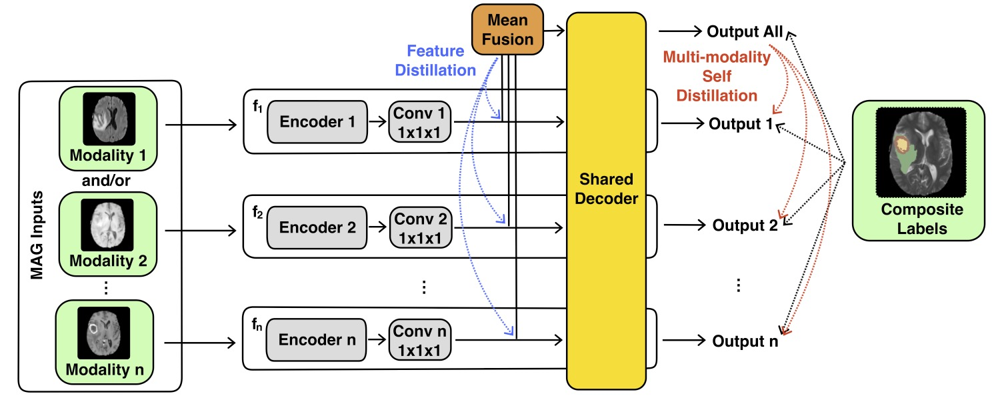

# Modality-Agnostic Learning for Medical Image Segmentation Using Multi-modality Self-distillation
This is the official implementation of **[MAGMS](https://arxiv.org/pdf/2306.03730)**.

For **[MAGNET: A Modality-Agnostic Networks for Medical Image Segmentation](https://ieeexplore.ieee.org/document/10230587)**, please check to branch [stable-1.1](https://github.com/kisonho/magnet/tree/stable-1.1).



## Pre-request
* Python >= 3.9
* [PyTorch](https://pytorch.org) >= 1.12.1
* [torchmanager](https://github.com/kisonho/torchmanager) >= 1.1
* [Monai](https://monai.io) >= 1.1

## Get Started
1. Load datasets
```python
training_dataset = ...
validation_dataset = ...
```

2. Simpy build the MAGNET (UNETR backbone) with `magnet.build` function
```python
num_modalities: int = ...
num_classes: int = ...
img_size: Union[int, Sequence[int]] = ...
model = magnet.build(num_modalities, num_classes, img_size, target_dict=target_dict)
```

3. Or use the deeper `magnet.nn` framework to customize MAGNET backbone
```python
encoder1: torch.nn.Module = ...
encoder2: torch.nn.Module = ...
fusion: torch.nn.Module = ...
decoder: torch.nn.Module = ...
model = magnet.nn.Magnet2(encoder1, encoder2, fusion=fusion, decoder=decoder)
```

4. Define MAGMS loss function
```python
main_loss_fn: list[Callable[[Any, Any], torch.Tensor]] = ...
kldiv_loss_fn: list[Callable[[Any, Any], torch.Tensor]] = ...
mse_loss_fn: list[Callable[[Any, Any], torch.Tensor]] = ...
self_distillation_loss_fn = magnet.losses.MAGSelfDistillationLoss(main_loss_fn, kldiv_loss_fn)
feature_distillation_loss_fn = magnet.losses.MAGFeatureDistillationLoss(self_distillation_loss_fn, mse_loss_fn)
loss_fn = feature_distillation_loss_fn
```

5. Compile manager and train/test
```python
optimizer = ...
metric_fns = ...

epochs = ...
callbacks = ...

manager = magnet.Manager(model, optimizer, loss_fn=loss_fn, metric_fns=metric_fns)
manager.fit(training_dataset, epochs, val_dataset=validation_dataset, callbacks=callbacks)
summary.test(validation_dataset)
print(summary)
```

## Monai Support
* Using `magnet.MonaigManager` instead of `Manager` 
* Post processing support with `post_labels` and `post_predicts`
```python
post_labels = [...]
post_predicts = [...]

manager = magnet.MonaigManager(model, post_labels=post_labels, post_predicts=post_predicts, optimizer=optimizer, loss_fn=loss_fn, metric_fns=metric_fns)
```

## Cite this work
```bibtex
@article{he2023modality,
  title={Modality-Agnostic Learning for Medical Image Segmentation Using Multi-modality Self-distillation},
  author={He, Qisheng and Summerfield, Nicholas and Dong, Ming and Glide-Hurst, Carri},
  journal={arXiv preprint arXiv:2306.03730},
  year={2023}
}
```
